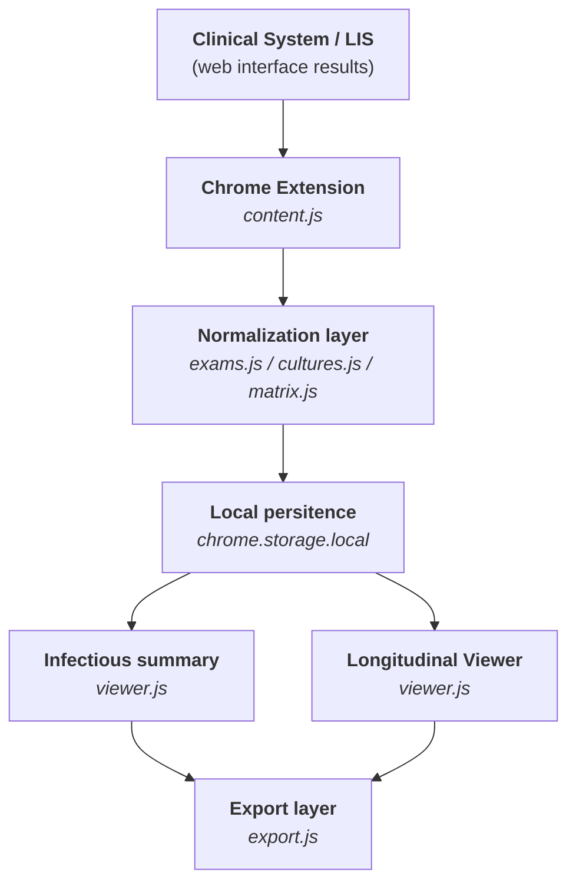
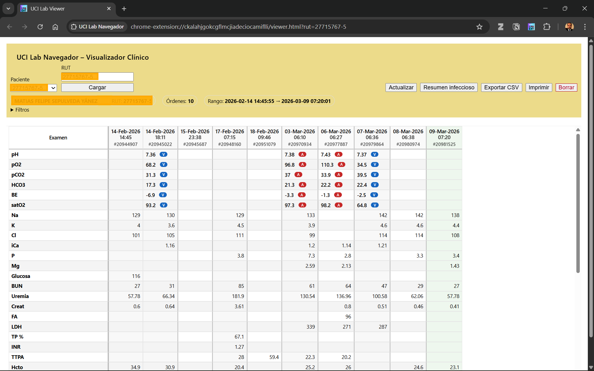
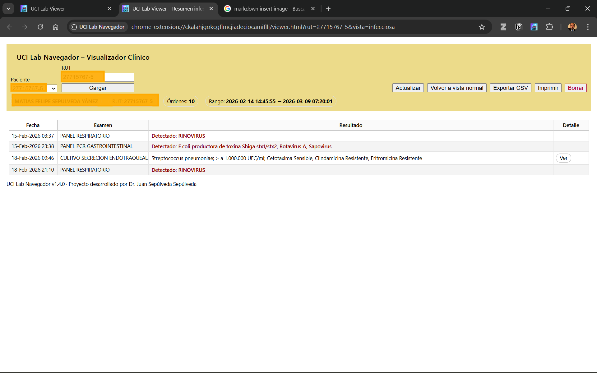

# UCI Lab Navegador – Project Documentation

Project developed by  
**Dr. Juan Sepúlveda Sepúlveda**

Longitudinal visualization of laboratory results and infectious summaries to support clinical work in Intensive Care Units.

The architecture allows extension to other hospital clinical units.

🇬🇧 English | 🇪🇸 [Español](README.es.md)


---

## License

This project is licensed under the GNU General Public License v3.0 (GPL-3.0).

Author: Juan Sepúlveda Sepúlveda
Year: 2026  

This software was developed as an independent clinical-academic initiative for longitudinal visualization of pediatric ICU laboratory data.

Commercial integration into proprietary laboratory information systems (LIS) may require additional authorization from the author depending on the integration model.

---

## 1. Overview

UCI Lab Navegador is a Chrome extension designed to:

- Recognize laboratory results from institutional clinical systems.
- Structure laboratory data longitudinally per patient.
- Visualize results in a clinical matrix format.
- Allow export and printing of structured data.
- Enable future automated detection of clinically relevant changes.
- Generate reports that facilitate interpretation of clinical evolution (tables, graphs) for clinical documentation, patient transfer summaries, or multidisciplinary discussions.

The objective is to transform fragmented laboratory data into a clear and clinically usable longitudinal view.

---

## 2. Clinical Context

Environment: Pediatric Intensive Care Unit (PICU) as the initial development setting.  
The architecture allows extension to other inpatient units or ambulatory settings where longitudinal laboratory follow-up is required.

Current problem:

Most institutional laboratory systems present results episodically rather than longitudinally.

This creates several challenges:

- Increased cognitive load
- Time-consuming navigation
- Risk of missing clinically relevant trends

The tool aims to reduce these limitations.

---

## 3. Current Technical Architecture

The system uses a patient-based persistence model that reconstructs the longitudinal laboratory history.

### 3.1 Application Type

Chrome Extension (Manifest V3)

### 3.2 Storage

```chrome.storage.local```

Persistence perr patient: (UCI_\<rut>)

### 3.3 Data Model

``` JSON

{
  "paciente": { "rut": "...", "nombre": "..." },
  "ordenes": {
    "<hash>": {
      "ordenOriginal": "...",
      "timestamp": "...",
      "fechaExtraccion": "...",
      "registros": [...]
    }
  }
}

```

## 3.4 Flujo general de procesamiento y visualización



---

## 4. Project Phases

### Phase 1 – Longitudinal Clinical Visualization

- Longitudinal HTML matrix
- Printing features
- Header visualization improvements

### Phase 2 – Support for Special Studies

- Cultures
- Molecular panels
- Hierarchical visualization models

### Phase 3 – Automated Clinical Analysis Layer

- Detection of significant changes
- Automatic highlighting
- Visual indicators
- Configurable rules
- Graph generation

---

## 5. Roadmap

- UX consolidation
- Visualization modularization
- Advanced laboratory panel support
- Automated clinical analysis layer
- Potential multi-user scalability

---

## 6. Design Principles

- Clinical priorities over technical complexity
- Minimal visual noise
- Reduced cognitive friction during clinical review
- Transparency in data processing
- No alteration of original HIS/LIS data
- Fully local processing

---

## 7. Security and Privacy

- No additional credentials required
- No direct access to institutional databases
- No external data transmission
- Processing is fully local
- No modification of institutional records

---

## 8. Assisted Development Acknowledgment

This project was developed with technical assistance from ChatGPT (OpenAI), used as a support tool for:

- Technical architecture
- Debugging
- UX design
- Data modeling
- Roadmap planning

Clinical direction, conceptual design, and functional decisions belong to the project author.

---

## 9. Current Status

Versión: 1.4

Stable version including:

- longitudinal laboratory visualization
- culture and special study support
- infectious summary
- CSV export
- JSON export/import for data portability and backup

---

## 10. Data Processing Flow

### Step 1 – Recognition

 ```content.js``` identifies:
  
- patient
- laboratory order
- raw result records

### Step 2 - Normalization

- exam alias mapping
- date normalization
- numeric normalization
- semantic unification (e.g. Lactate)

### Step 3 - Canonicalization

A deterministic order representation is created.

### Step 4 - Hash Generation

Primary: SHA-256
Fallback: FNV-1a

The hash becomes the unique key.

### Step 5 - Persistence

``` YAML

chrome.storage.local
Key: UCI_<rut>
Subkey: <hash>
```

### Step 6 - Matrix Construction

- chronological column ordering
- exam rows defined by MAP_EXAMENES
- dynamic rows for additional parameters

### Step 7 - Visualization

- day grouping
- latest column highlight
- numeric alignment
- visual separators

#### Visualization example





### Step 8 – Export and data portability

The system allows export processed patient data in different formats.

#### CSV Export

The system generates a bidimensional matrix that includes:

- patient metadata
- exam rows
- chronologically ordered columns
- HASH verification row

This format is intended for:

- external review
- report generation
- tabular analysis

#### JSON Export

Version 1.4 introduces full export of the patient's data model in JSON format.

Structure of the exported file:

```json
{
  "format": "uci-lab-navegador",
  "version": 1,
  "exportedAt": "...",
  "patientKey": "...",
  "data": { ... }
}
```

#### JSON Import

The system also allows importing previously exported JSON files.

During the import process, the system validates:

- file format
- schema version
- presence of the patient identifier (RUT)
- structure of clinical orders

Once validated, the patient data is reconstructed in:

```chrome.storage.local```

This allows transferring information between different computers without requiring direct access to the LIS system.

---

## 11. Expected Clinical Impact

The tool aims to improve longitudinal interpretation of laboratory data in hospitalized patients, particularly in high-complexity environments such as Intensive Care Units.

Expected benefits include:

- Improved trend visualization
- Reduced cognitive load
- Better monitoring of infectious processes
- Improved communication during clinical rounds
- Future support for automated clinical analysis

---

## 12. Clinical Use Case

In pediatric intensive care units (PICU), patients frequently undergo multiple laboratory tests per day. Laboratory information systems (LIS) typically present results organized by individual test reports, which makes longitudinal interpretation of multiple parameters difficult.

For example, during the clinical review of a patient with septic shock, the clinician may need to simultaneously evaluate trends in lactate, arterial blood gases, inflammatory markers, renal function, and hematologic parameters across several days.

In the standard LIS interface, these results are distributed across multiple reports, requiring the clinician to manually integrate information from different screens.

UCI Lab Navegador reorganizes these results into a single longitudinal matrix centered on the patient, where each column represents a sampling time and each row corresponds to a laboratory parameter or clinical
panel. This visualization facilitates rapid identification of trends and supports clinical interpretation during bedside rounds.

---

## 13. Citation

If you use this software in clinical work, research,
or derivative projects, please cite:

Sepúlveda J.  
**UCI Lab Navegador: Visualización longitudinal de exámenes de laboratorio para apoyo clínico en UCI Pediátrica.**  
Open-source software project.  
Available at: [https://github.com/Enesimus/uci-lab-navegador](https://github.com/Enesimus/uci-lab-navegador)

---

## 14. Disclaimer

This tool does not modify or interfere with any laboratory information system. It operates exclusively at the user interface level and stores data locally.

This tool is intended as a clinical support visualization utility and not as a diagnostic decision system.

The author assumes no responsibility for clinical decisions derived from its use.

---
