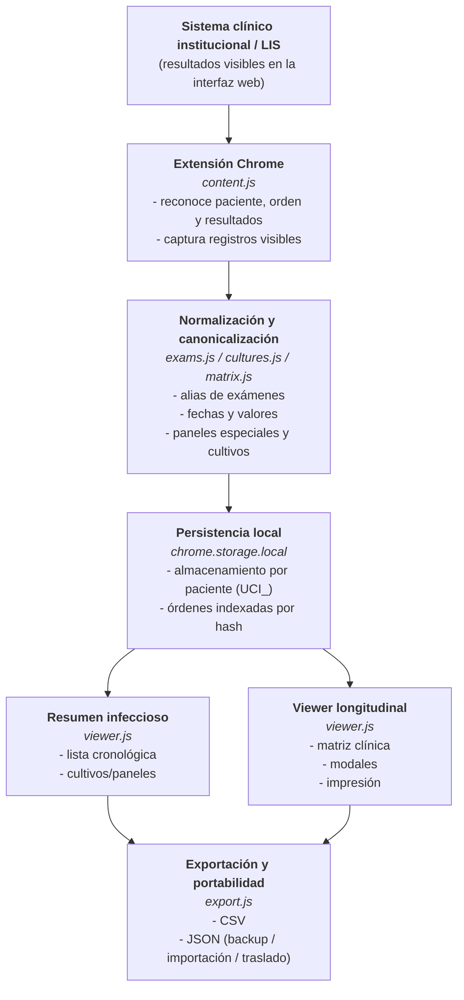

# UCI Lab Navegador – Documentación del Proyecto

Proyecto desarrollado por  
**Dr. Juan Sepúlveda Sepúlveda**

Visualización longitudinal de exámenes de laboratorio y resumen infeccioso para apoyo clínico en Unidades de Cuidados Intensivos.

La arquitectura permite su extensión a otras unidades clínicas hospitalarias.


---

## License

This project is licensed under the GNU General Public License v3.0 (GPL-3.0).

Author: Juan Sepúlveda Sepúlveda
Year: 2026  

This software was developed as an independent clinical-academic initiative for longitudinal visualization of pediatric ICU laboratory data.

Commercial integration into proprietary laboratory information systems (LIS) may require additional authorization from the author depending on the integration model.

---

Este proyecto está licenciado bajo la GNU General Public License v3.0 (GPL-3.0)

Autor: Juan Sepúlveda Sepúlveda
Año: 2026

Este software fue desarrollado como una iniciativa clínica-académica para la visualización longitudinal de los datos de laboratorio de una UCI Pediátrica.

La integración comercial en Sistemas de Información de Laboratorio (LIS) o su redistribución como parte de software de fuente cerrada requiere la autorización explícita del autor.

---

## 1. Descripción General

UCI Lab Navegador es una extensión de Chrome diseñada para:

- Reconocer exámenes de laboratorio desde el sistema clínico institucional.
- Estructurarlos longitudinalmente por paciente.
- Visualizarlos en formato matricial clínico.
- Permitir exportación e impresión.
- Evolucionar hacia análisis automático de cambios clínicamente relevantes.
- Generar reportes que faciliten la comprensión de la evolución clínica (gráficas, tablas) para la confección de resúmenes clínicos (evolución, traslado o para reuniones clínicas).

El objetivo es transformar información fragmentada en una vista clínica longitudinal clara, rápida y usable.

---

## 2. Contexto Clínico

- Entorno: Unidad de Cuidados Intensivos Pediátricos como punto de partida. Pudiera extenderse a cualquier unidad de paciente hospitalizado, o en atencion ambulatoria cuando se requiera un seguimiento longitudinal de examenes.
- Necesidad: Visualización rápida de tendencias y evolución de parámetros.
- Problema actual: Sistemas institucionales presentan resultados en forma episódica, no longitudinal.

La herramienta busca reducir:

- Carga cognitiva.
- Tiempo de navegación.
- Riesgo de omitir cambios relevantes.

---

## 3. Arquitectura Técnica Actual

El sistema utiliza un modelo de persistencia por paciente que permite reconstruir la historia longitudinal de exámenes.

### 3.1 Tipo de aplicación

Extensión Chrome (Manifest V3).

### 3.2 Almacenamiento

```chrome.storage.local```

Persistencia por paciente (UCI_\<rut>)

### 3.3 Modelo de datos

``` JSON

{
  "paciente": { "rut": "...", "nombre": "..." },
  "ordenes": {
    "<hash>": {
      "ordenOriginal": "...",
      "timestamp": "...",
      "fechaExtraccion": "...",
      "registros": [...]
    }
  }
}

```

## 3.4 Flujo general de procesamiento y visualización



---

## 4. Fases del Proyecto

### Fase 1 – Visualización clínica longitudinal

- Vista HTML longitudinal
- Sidebar
- Impresión
- Mejora visual del encabezado

### Fase 2 – Soporte para estudios especiales (cultivos y paneles moleculares)

- Modelo distinto al matricial
- Visualización específica
- Estructura jerárquica

### Fase 3 – Capa de análisis clínico automatizado

- Detección de cambios significativos
- Resaltado automático
- Indicadores visuales
- Reglas configurables
- Creación de gráficas

---

## 5. Roadmap General

- Consolidación UX
- Modularización de visualización
- Soporte estudios complejos
- Capa de análisis clínico
- Posible escalabilidad multiusuario

---

## 6. Principios de Diseño

- Prioridad clínica sobre técnica.
- Minimizar ruido visual.
- Reducir la fricción cognitiva durante la revisión clínica.
- Transparencia en el procesamiento de datos.
- No alterar datos originales del HIS.
- Procesamiento completamente local.

---

## 7. Seguridad y Privacidad

- No requiere credenciales adicionales ni acceso directo a bases de datos institucionales.
- No envía datos a servidores externos.
- Procesamiento 100% local.
- No almacena información fuera del navegador del usuario.
- No modifica registros institucionales.

---

## 8. Reconocimiento de Desarrollo Asistido

Este proyecto fue desarrollado con asistencia técnica de ChatGPT (OpenAI), utilizado como herramienta de apoyo en:

- Arquitectura técnica
- Depuración
- Diseño de experiencia de usuario
- Modelado de datos
- Planificación de roadmap

La dirección clínica, conceptual y las decisiones funcionales corresponden al autor del proyecto.

---

## 9. Estado Actual

Versión: 1.4

Estado: versión estable con:

- visualización longitudinal de exámenes
- soporte para cultivos y estudios especiales
- resumen infeccioso
- exportación CSV
- exportación e importación JSON para respaldo y portabilidad de datos

---

## 10. Flujo de Procesamiento de Datos

### Paso 1 – Reconocimiento

- ```content.js``` reconoce:
  - Paciente
  - Orden
  - Registros crudos

### Paso 2 – Normalización

- Alias mapping de exámenes
- Normalización de fecha
- Normalización numérica
- Unificación semántica (ej. Lactato)

### Paso 3 – Canonicalización

Se construye una representación determinística de la orden.

### Paso 4 – Hash

Se calcula:

- SHA-256 (principal)
- FNV-1a (fallback)

El hash se convierte en clave única.

### Paso 5 – Persistencia

Se guarda en:

``` YAML

chrome.storage.local
Clave: UCI_<rut>
Subclave: <hash>
```

### Paso 6 – Construcción de matriz

- Se ordenan columnas cronológicamente
- Se construyen filas según MAP_EXAMENES
- Se agregan extras dinámicos

### Paso 7 – Visualización

- Agrupación por día
- Highlight última columna
- Alineación numérica
- Separadores visuales

#### Ejemplo de visualizacion


### Paso 8 – Exportación y portabilidad de datos

El sistema permite exportar los datos procesados del paciente en distintos formatos.

#### Exportación CSV

Se genera una matriz bidimensional que incluye:

- Metadata del paciente
- Filas de exámenes
- Columnas cronológicas
- Fila de verificación HASH

Este formato está orientado a:

- revisión externa
- generación de reportes
- análisis tabular

#### Exportación JSON

La versión 1.4 incorpora exportación completa del modelo de datos del paciente en formato JSON.

Estructura del archivo exportado:

```json
{
  "format": "uci-lab-extractor",
  "version": 1,
  "exportedAt": "...",
  "patientKey": "...",
  "data": { ... }
}
```

### Importación JSON

El sistema también permite importar archivos JSON previamente exportados.

Durante la importación se valida:

- formato del archivo
- versión del esquema
- existencia del RUT del paciente
- estructura de órdenes clínicas

Una vez validado, el paciente se reconstruye en:

```chrome.storage.local```

Esto permite trasladar información entre distintos equipos sin depender del acceso directo al sistema LIS.

<!-- >💡 **Nota**: los permisos de acceso en el ```manifest.json``` para intranet como en acceso externo son:
>
> ``` JSON
>"host_permissions": [
>  "http://200.72.31.213/*",
>  "http://10.6.127.136/*"
>],
>"content_scripts": [
>  {
>    "matches": [
>      "http://200.72.31.213/GestionIntegrada/*",
>      "https://10.6.127.136/GestionIntegrada/*"
>    ],
>    "js": ["content.js"]
>  }
>]
>``` -->

---

## 11. Impacto Clínico Esperado

La herramienta busca mejorar la interpretación longitudinal de los exámenes de laboratorio en pacientes hospitalizados, especialmente en entornos de alta complejidad como las Unidades de Cuidados Intensivos.

Los beneficios clínicos esperados incluyen:

- **Mejor visualización de tendencias**: permite observar cambios progresivos en parámetros de laboratorio que pueden pasar desapercibidos en visualizaciones episódicas tradicionales.
- **Reducción de carga cognitiva**: al agrupar y estructurar los resultados longitudinalmente, disminuye el tiempo requerido para reconstruir la evolución clínica de un paciente.
- **Apoyo al seguimiento de procesos infecciosos**: la visualización integrada de cultivos y paneles moleculares facilita la identificación rápida de patógenos detectados y su evolución en el tiempo.
- **Facilitación de la comunicación clínica**: la exportación e impresión de matrices longitudinales permite generar resúmenes claros para discusiones clínicas, traslados de pacientes o reuniones de equipo.
- **Potencial para análisis clínico automatizado**: la arquitectura del proyecto permite incorporar en el futuro reglas de detección de cambios clínicamente relevantes y generación automática de alertas o visualizaciones analíticas.

En conjunto, el objetivo es transformar datos de laboratorio presentados de forma fragmentada en una representación longitudinal comprensible que facilite la toma de decisiones clínicas.

---

## Disclaimer

This tool does not modify or interfere with any laboratory information system. It operates exclusively at the user interface level and stores data locally.

This tool is intended as a clinical support visualization utility and not as a diagnostic decision system.

The author assumes no responsibility for clinical decisions derived from its use.

---

Esta herramienta no modifica ni interfiere con ningún sistema de información de laboratorio. Opera exclusivamente en el nivel de interfase de usuario y almacena datos localmente.

Esta herramienta está pensada como una utilidad de visualización de apoyo clínico y no como un sistema de decisión diagnóstica.

El autor no se responsabiliza por decisiones clínicas derivadas de su uso.

---
